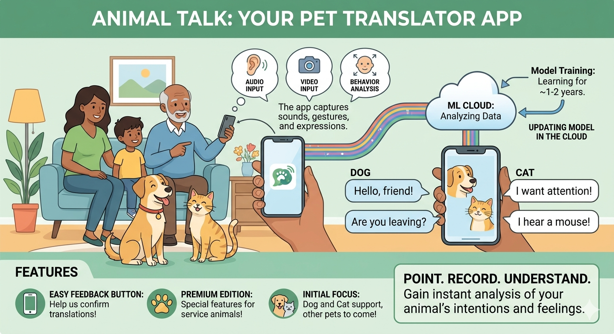

## Exercise #1: Executive Pitch Prompt Engineering

A design team recorded a brainstorming session aimed at designing a new app. We captured the transcript of that highly creative session. Prompt an LLM to create an email based on the transcript. The email should aim to convince the vice-president of engineering to fund development of the pet translator app. The vice-president is busy, so keep the email short and focused.

## Answer 1

You are a desginer planning to design a new app, the pet translator app, with your team. Based on the transcript,write an email to the vice-president of engineering. After reading the email, the vice-president should be convinced to to fund development of the pet translator app. Keep the email short and focused.

## Answer 2 (Corrections using LLMs)

**Role:** Act as a designer planning to design a new app, the pet translator app, with your team.  
**Audience:** The vice-president of engineering.   
**Task:** Based on the transcript provided below, write an email. Keep the email short, pitch-focused. After reading the email, the vice-president should be convinced to fund development of the pet translator app.  
**Email Requirements:**
- Length: Maximum of 2 to 3 paragraphs or fewer than 5 bullet points.
- Structure: Subject line, the core value proposition (why this app matters), and a direct CTA (asking for funding/a meeting).
- Tone: Professional, data-driven and enthusiastic.   

[BRAINSTORMING TRANSCRIPT HERE](https://developers.google.com/tech-writing/two/artifacts/design-meeting-transcript)

## Exercise #2 

We've captured the [transcript](https://developers.google.com/tech-writing/two/artifacts/design-meeting-transcript) of an overly creative brainstorming session to design a new app.

**Task 1**: Prompt your favorite LLM to generate a one-sentence summary of the pet translation app discussed in the brainstorming meeting. (Copy-and-paste the transcript along with the prompt.) This summary should get other engineers interested in working on the project.

## Answer 

**Role**:You are a senior engineer.  
**Audience**: Other engineers.  
**Task**: Based on the transcript provided below generate a one-sentence summary of the pet translation app discussed in the brainstorming meeting. Keep the summary pitch - focused. After reading the summary, other engineers should be interested in working on the project.

[BRAINSTORMING TRANSCRIPT HERE](https://developers.google.com/tech-writing/two/artifacts/design-meeting-transcript)

**Task 2**: Prompt your favorite LLM to create an image representing the app. The image should help non-technical people understand the app.

## Answer 

**Role**: You are a senior designer.   
**Audience**:  non-technical people.  
**Task**: Based on the transcript provided below generate an image representing the app. The image should help non-technical people understand the app.

[BRAINSTORMING TRANSCRIPT HERE](https://developers.google.com/tech-writing/two/artifacts/design-meeting-transcript)

## Case Study: Visual Synthesis of Complex Requirements Using AI

### The Challenge
Transforming a [3-page brainstorming transcript](https://developers.google.com/tech-writing/two/artifacts/design-meeting-transcript) (filled with design detours, jokes, and technical scope creep) into a clear visual asset that a non-technical user can understand.

### My Role
I designed the prompts and logical structure to guide the AI in generating an accurate infographic. My focus was on filtering out technical noise (such as infrastructure discussions) while preserving the core value proposition of the product.

### The Visual Result

*Note: In a real production environment, I would clean up the redundant copy generated by the visual AI model to strictly align with company style guide standards.*